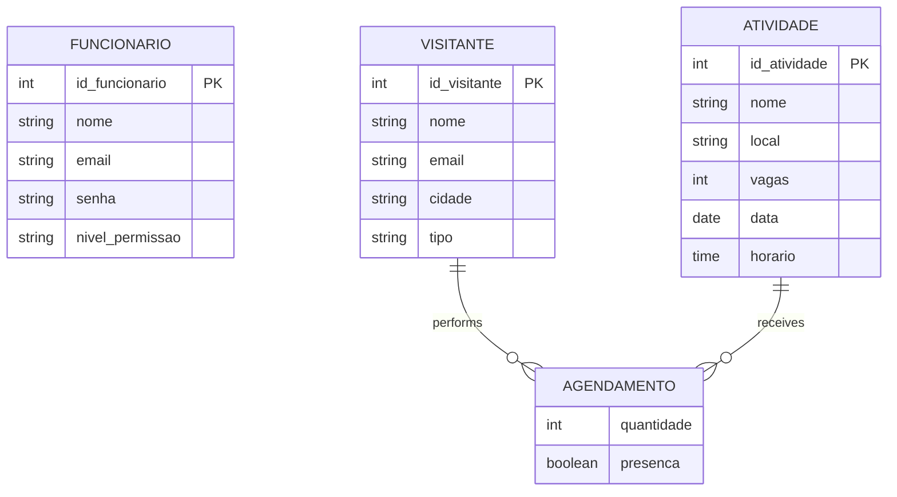

# 🌿 LENPA Backend API | Event & Visitor Management

RESTful API developed to manage the scheduling system for the Laboratory of Native Species and Environmental Practices (LENPA). This service is the core of the data processing, responsible for registering visitor attendance at events and workshops, as well as providing structured data to generate administrative reports.

> 💻 **Front-end Application**
> 
> This repository contains the back-end API built with Java. The client-side application (Front-end), developed in Angular, consumes these services to provide the visual interface for visitors and administrators **[CLICK HERE TO ACCESS THE FRONT-END REPOSITORY](https://github.com/FeltrinLM/LENPA-frontend)**.

---

## 🎯 Core Features

The system was designed to securely process business rules focused on event management and capacity control:

*   **Identity & Access Management (IAM):** User authentication with strict privilege separation between "Scholar" (Bolsista) and "Administrator" roles.
*   **Activity Management:** Full CRUD operations for events and workshops, actively managing critical information such as date, time, location, and seat limits.
*   **Scheduling & Attendance Engine:** Processes requests for public and private seat reservations, including a "check-in" feature (manual attendance confirmation).
*   **Report Processing:** Logic for extracting and filtering database records by specific time periods, providing total participation statistics and the demographic distribution of visitors' cities.

## 🏗️ Architecture & Database

The relational data architecture was modeled to ensure reservation integrity, preventing overbooking in limited-capacity events. The primary database used is PostgreSQL.

### Key Domain Entities:
*   **Employee (Funcionário):** Stores secure credentials and permission levels for system managers.
*   **Activity (Atividade):** Represents the actions offered, storing logistical details and maximum capacity.
*   **Visitor (Visitante):** Maintains demographic and identification data of the external public for accreditation.
*   **Scheduling (Agendamento - Associative Entity):** Connects Visitors and Activities, recording the number of occupied seats and whether the reservation evolved into a confirmed presence.

## 🚀 Infrastructure & Deployment

The application was designed with a focus on high portability and rapid deployment across different environments.

*   **Containerization:** The entire application (Spring Boot API) and its data infrastructure (PostgreSQL) are packaged and orchestrated together using `Dockerfile` and `docker-compose` files.
